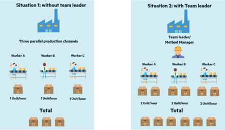
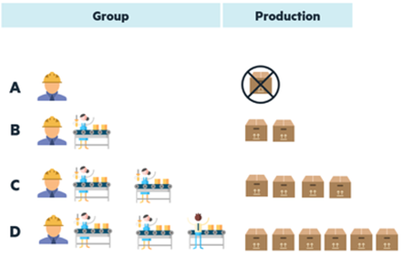
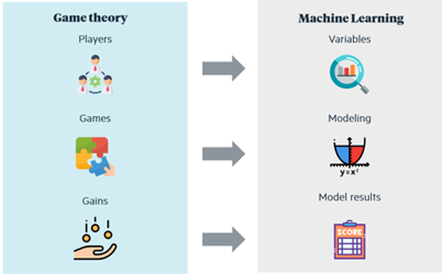
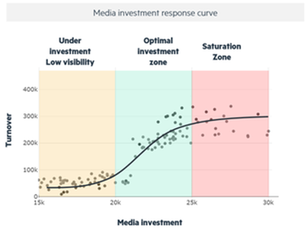

<!--truncate-->
 

## Introduction

Over the past decade Machine Learning (ML) algorithms have developed
drastically, with predictions becoming more accurate through innovative Neural
Networks architectures and increased storage capacities. Yet despite this, ML
algorithms are frequently still considered a “black-box”, rendering them
difficult to read and tough to translate into actual business decisions.

At Ekimetrics we believe that sole reliance on the accuracy and performance of
algorithms for the final output is not an acceptable answer in itself. We work
with Fortune 500 companies and demanding C-level clients who not only want to
know exactly « what » they should do, but also « why » they should do it. In
other words, as strategy consultants as well as data scientists, we need to
recommend actionable and explainable decisions to our clients.

With this in mind, explaining the effects of a change in marketing variables
(investment planning, CRM decisions, investment channels etc.) is mandatory.
Regardless of the sector, these insights are fundamental in allowing our
clients' to succeed in their strategy (whether this be predicting an increase in
revenue in the automotive industry, or forecasting the number of booked rooms
for a multinational hospitality company).

As a result, the focus on **interpretability** is just as important as the
predictive accuracy of our models.

The need for interpretability creates a trade-off in ML algorithms and is a
central discussion in the data science and business arenas. While algorithms
like multi-linear regression are perfectly readable, Neural Networks or Boosting
Trees algorithms provide a better fit to reality. Their inclusion however only
increases this scope of varying interpretability.

That is why Ekimetrics created its own adapted **SHAP** Python packages (based
on Shapley values), allowing us to use the most advanced data science
methodologies and take a hybrid approach on marketing mix modeling (MMM). With
this solution, we are able to enhance both the depth and the quality of MMM
analysis, to deliver the most advanced business insights available.

## 1. Moving away from linear models in econometrics

Marketing Mix Optimization, most often referred to as MMO (and a newer version
of Marketing Mix Modeling), is a complex process that models the effects of
marketing investments. The goal is to measure the contribution of each media or
marketing lever on the output variable (most often “Sales”), to optimize the
allocation of marketing investment. Based on the results produced, allocation of
marketing budgets can be adjusted to provide the greatest impact on sales.

The modeling starts from a census of all marketing investments made over a past
period. The output allows us to analyze the impact of investments on global
sales.

 

The main drawback of conventional MMM is its low level of complexity and
shallower gradients of analysis. The most common MMM algorithms do not meet the
depth and finesse of advanced machine learning models. Tactical marketing
strategies in particular may be missed by classic MMM, and because of this it is
often used as a strategic decision support tool, rather than a daily tactical
steering solution.

The main reason for applying simple algorithms such as those used in MMO lies in
the complexity of the interpretability for more sophisticated data science
models. Applying MMO in this instance however means we end up with a glass
ceiling in our analyses.

Achieving greater granularity in the depth of analysis is often a tedious
process that involves a multitude of simple and weak sub-models. Considerations
over non-linearities are generally poorly developed and provide a low level of
precision in conventional tools such as multi-linear regressions. Additionally
it means cross-effects between variables remain difficult to assess.

On the other hand, advanced data science algorithms such as gradient boosting
techniques are much more sophisticated than multiple regressions. They allow us
to detect not only non-linearities but also weak signals, enabling us to further
empower our MMM analysis. And with this, the intelligent application of Shapley
values leads to more interpretability and precision, and the exact contribution
of each marketing lever is gathered in a more sophisticated AI tool.

By leveraging our culture of continuous improvement in data science practices,
we have evolved our marketing measurement approach to establish a new
best-in-class for marketing interpretability. Using Shapley Values we can
implement the technology that takes into account non-linear aspects of marketing
campaigns, without sacrificing our understanding of the business implications
for our clients.

 

 
## 2. How to crack interpretability in marketing measurement and AI projects

“Shapley Values” find their origin in Game Theory. Their objective is to fairly
distribute gains in a system between the members of a set group, when the
contributions of the members are unequal. The fields of Shapley Values
application are diverse, from business or marketing right up to machine
learning.

As an illustration, the example below details the computation of Shapley Values
within an industrial framework. In the first situation, each worker produces one
unit per hour. Without any other participants, it’s easy to allocate equally the
production rewards to each of the three workers.

However, in the second Situation, a team leader has been introduced to the
factory. His goal is to optimize the production process. Thanks to his work, the
production of each worker doubles.

 

In this case, it’s not obvious how to distribute the production rewards between
the workers and the team leader.

One might allocate the extra unit of production to the team leader. However, it
is possible to object that the production of these extra units would not be made
possible without the workers (under the hypothesis that the team leader is not
allowed to produce anything himself).

The figure below presents the production related to each group including the
team leader.

 
 
Computing the contribution of the team leader requires listing all the possible
groups without him present, and recording the performance. Subsequently the team
leader can be included in each of these groups to measure the impact on final
results. Averaging the difference in production of each group (with and without
the team leader) allows us to measure the global contribution (or Shapley value)
of the team leader.
 
 

In this case the contribution or Shapley value for the team leader is 1/5 and
for the workers is 1/16.

This approach can be easily reapplied to ML algorithms, specifically to
interpret black-box modeling where variables, models, and predictions are
equivalent to the players, games, and rewards of game theory.

  

Thanks to the computation of Shapley using the SHAP python package, it’s
possible to open the black box and assess the impact of each variable on the
output against the base rate.

  
 
With this approach it’s possible to enhance the depth of marketing mix analysis.
We are able to catch the non-linear and cross-effect between marketing levers,
without loss of performance that would arise from interpretability issues in
accordance with these black-box constraints.

Compared to other cutting edge technology like LIME *(Local Interpretable
Model-agnostic Explanations)*, SHAP methodology presents several advantages.
Where LIME provides an explanation by an approximated local linear model, SHAP
does not need this approximation and guarantees a fair distribution of the
contribution between variables. Thanks to this simplicity and its theoretical
guarantees, the application of SHAP is much more widespread in the data science
community.

The limitation of the classic SHAP package is that it provides the contribution
of a variable relative to the base value of the model. This is why at Ekimetrics
we developed a specific application of Shapley values derivated from the SHAP
package, in order to compute absolute marketing incremental, and allowing us to
provide the same metric as the classic Marketing Mix Modeling approach.

## 3. Understanding artificial intelligence algorithms allows us to capture complex business insights

The application of machine learning makes it possible to integrate more
complexity and finesse into marketing mix models. Weak non-linear signals -
hardly detectable when using classic econometric models - can be calculated with
far greater precision, elevating us into a new era of marketing measurement.  

The first example presented below aims to evaluate the impact of media
investment on the turnover of a product.
 
   

Where classic marketing measurement only considers the linear effect, an ML led
approach was able to capture the real non-linear response curve, enabling us to
quickly identify investment thresholds and associated saturation zones. The
response curve's identification of the media levers helped optimize the
allocation of investments, guaranteeing a higher level of incremental sales,
without degrading efficiency and return on investment.

A second example presented below allows us to visualize the performance of
promotional campaigns, according to the discount rate applied.
 
   

From this approach, it is possible to identify two distinct levels of impact:
the first at which promotions generate similar incremental sales, and a second
level at which sales rise rapidly with an increase in promotional depth. Using
this method Ekimetrics can optimize the promotional pressure and the media
investments, to guarantee consistency and optimal effectiveness for the entire
marketing strategy.

## Conclusion

The performance of Machine Learning algorithms is generally superior to
traditional marketing measurement tools (taking into account cross-effect and
non-linear response curves, detection of weak signals etc.). But often a lack of
transparency and interpretability limits the business actionability of the
algorithms predictions.

Thanks however to our Shapley Values-based methodology, we have been able to
push back the boundaries of marketing analysis, by taking advantage of the power
of data science and its accompanying tools. Not only are we able to identify the
best strategies, but we can also guarantee transparency and simplicity on the
interpretation of the algorithm’s results.

