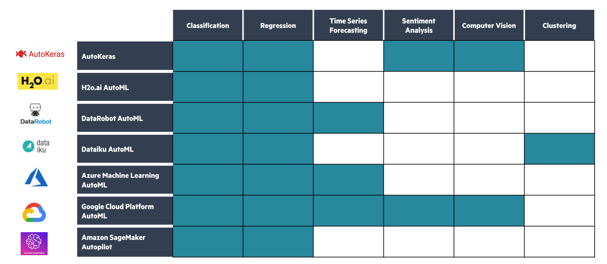
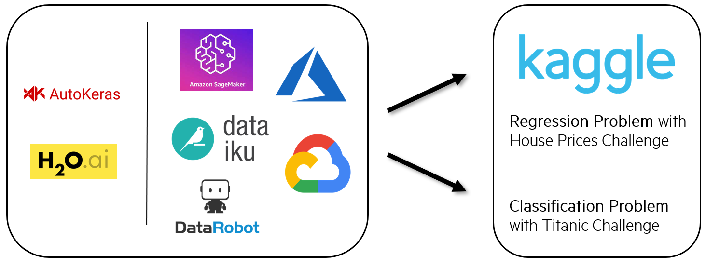
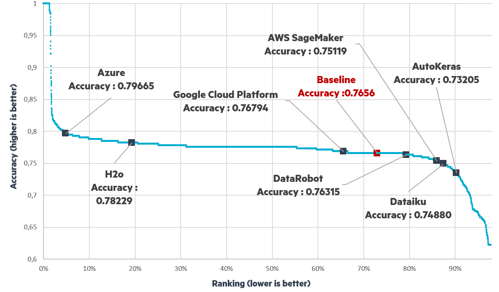
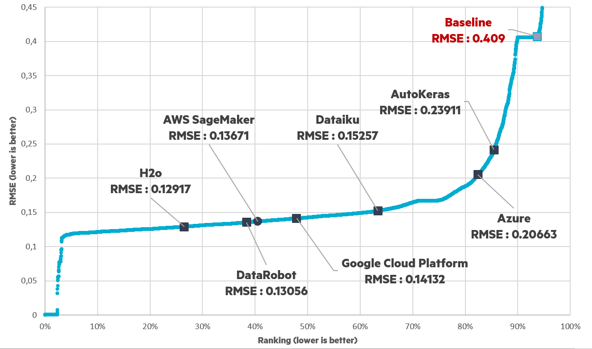
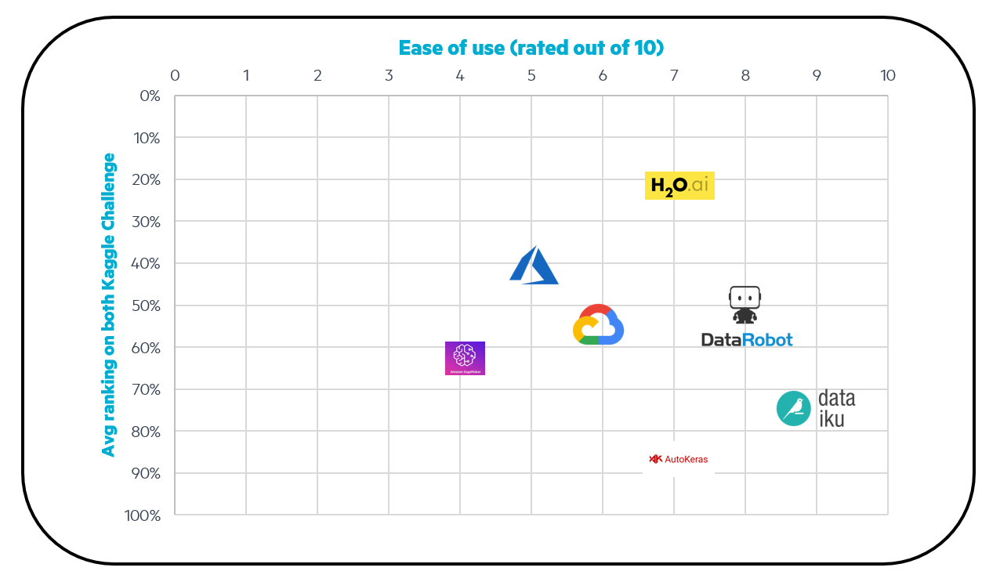

<!--truncate-->

Applying traditional Machine Learning methods to real-word business problems can be time-consuming, resource-intensive and expensive. With Automated Machine Learning (Auto ML) however, it can take days at most for business professionals & Data Scientists alike to develop and compare dozens of models, find insights and solve business problems quickly. But what is AutoML, how does it work and what are the most popular AutoML solutions out there? In this article, we will introduce the field of Automated Machine Learning by exploring some popular AutoML frameworks and trying to answer those questions around how to make the right choice for your use case.

## What is AutoML and why it is interesting?

### Definition

Sebastian Raschka, a well regarded American statistics professor, states: ‘’Computer programming is about automation, and Machine Learning is all about automating automation’’. If that’s true then we can say that Automated Machine Learning is the automation of automating automation..! AutoML is a new optimization technique which aims at automating some of the core - but highly iterative - parts of the traditional modelling process in ML, in particular feature selection and model selection (including hyperparameter tuning and stacking). Let’s take the example of a Decision Tree Algorithm. This algorithm has many hyperparameters (leaf, depth, split etc.) and browsing through all those hyperparameters can take days. An AutoML algorithm can intelligently explore all the possible parameters in order to find the best possible ML algorithm solving a given task. Some advanced AutoML algorithms can even choose between different features, create new ones and try different data cleansing scenarios!

### How AutoML can help us?

There are many steps in a Machine Learning project, with Model Training typically being one of the most time consuming. A standard project will focus on a Business Problem and will pass through Data Collection, Cleaning and Processing before the training phase. Model Training can then be cumbersome as we have to select an appropriate model family and to fine tune many times differents hyperparameters before building the analysis and deploying the model. This process can take weeks or months, but it seems that several steps can be automated using optimization algorithms and that is the goal of auto ML.

 

In a sense, AutoML is seen as a way to increase productivity, to allow the Data Scientist to focus more on defining the problem and the analyses rather than the models finetuning, to help avoiding errors, and on top of that, to democratize Machine Learning so that everyone can leverage its power. Its integration within ML Engineering environment allows to streamline pipeline and integrate specific training jobs, that allows to parametrize a model search completely from a simple configuration file.

### Overview of the main AutoML frameworks in the market

For this article, we have selected 7 well known AutoML frameworks, but many more exist in the market. Below is an overview of some of the types of Data Science problems these AutoML solutions can address. Among them two are open source: AutoKeras & H2o and the others are not: with DataRobot, Dataiku, Azure, GCP, and AWS SageMaker. (2 other open-source solutions AutoKeras and AutoGluon were studied, but these frameworks are not available on Windows.)

Many of the AutoML solutions address different types of Data Science problems such as Sentiment Analysis or Computer Vision, however what is going to interest us for the rest of is article are the Classification and Regression ML problems.

## Exploring the capabilities of several AutoML solutions

### Our methodology (Classification/Regression, datasets Kaggle)

The purpose here is to bring some knowledge in the field of **Automated Machine Learning** by **exploring some popular AutoML frameworks**. In order to establish a performance benchmark, we decided to test those frameworks on **common ML topics** like **Regression** and **Classification**. The idea is also to share our personal experience (and difficulties encountered) with those tools so that everyone can have an overview of each one these AutoML solutions.

These packages were benchmarked on two classical datasets available on Kaggle. We chose the **Titanic Challenge** ([Titanic - Machine Learning from Disaster | Kaggle](https://www.kaggle.com/c/titanic/overview)) for the Classification problem and the **House Prices Challenge** ([House Prices - Advanced Regression Techniques | Kaggle](https://www.kaggle.com/c/house-prices-advanced-regression-techniques/rules)) for the Regression problem. For each framework, we submitted predictions on the test set on Kaggle so that we can compare the results to the general leaderboard. What is interesting with this approach is that we were able to compare performance not only between each AutoML solution but also with individual performance.

### Our results

#### Classification Problem - Titanic Challenge

The Titanic Challenge is one of the most famous on Kaggle with more than 30,000 challengers. The objective is to have a model which will predict if a Titanic passenger survives or not on a small data set with 9 features and around 900 rows in the training set. The metric used for this challenge is the accuracy and the leaderboard we have downloaded from Kaggle is provided below.

Each point represents a challenger with the performance of all tested frameworks noted, with ranking & accuracy plotted on the x and y axis. We found that Azure has the best accuracy followed by H2O and that the accuracy for all frameworks ranges within 73% - 80%.

#### Regression Problem - House Prices Challenge

For the House Prices Challenge, the goal is to predict the final price of residential homes in the United States. This time the metric is the root mean squared error, which is a metric that tells us the average distance between the predicted values from the model and the actual values in the dataset. We have around 8000 challengers (less challengers than the Titanic Challenge) and the dataset here is bigger with more than 250 features and around 1400 rows in the training set.

We can see that all frameworks did better than the baseline RMSE. Each of the tested models fall between 0.24 - 0.12 in terms of the RSME and H2O again performs the best among other tested frameworks.

## Conclusion

### Which AutoML solutions to choose?

In conclusion, which AutoML to choose? When making our decision, the framework performance is important, but not all frameworks were in fact easy to use. Conversely, we spent a lot of time on some frameworks, because some of them were not as intuitive as expected.

User friendliness must also therefore be a major criterion to consider when you are wondering which AutoML to use. That’s why, in order to consider the frameworks performance on both the Kaggle challenge but also the user friendliness of each solution (if it is easy to install it, to get familiar with the tool, to set up the experiment without errors), we built two further metrics to evaluate each AutoML framework and to compare them.

- On the x-axis: we give the ease of use for each AutoML framework from 1 to 10 (10 being the best)

- On the y-axis: we took the average ranking on the both Kaggle challenge (the closer to 0, the better)

The metric 'ease of use' is somewhat subjective as it refers to our own personal experience. However, we would add that one of the goals of AutoML is to make Machine Learning accessible to everyone, so for someone with very little knowledge, it is interesting to see how accessible the differents tools are.

We found that:

- The cloud solutions are more difficult to master especially if you’ve never used cloud computing before. In fact, some time is needed to get familiar with all the different functionalities of cloud solutions like Azure, AWS or GCP as there are powerful and comprehensive tools.

- Dataiku and DataRobot are very easy to use and very visual, with many icons. These interfaces are very clear and simple.  If you want to use an extremely easy-to-use AutoML tool, which can perform automated machine learning very quickly, DataRobot and Dataiku seem to be good solutions.

- H2O works as a notebook so if you are familiar working on a Jupyter notebook for example, it can definitely be a good option and not too painful to use. H2O seems to be a very good choice in terms of performance and ease of use. Moreover, this framework has the advantage of being completely open source.

### Final thoughts, our key takeaways

This article tries to compare 7 majors AutoML frameworks. To do so, we introduced a methodology that considers the performance of each solution, but also their ease of use. What appears clearl is that AutoML can definitely be a good starting point to an ML project. In fact, for both the Classification and Regression problem, all the frameworks performed almost as well, even better sometimes than the baseline, just by using the AutoML functionality.

However, it is important to remember that automatically generated pipelines are still very basic and are not able to beat human experts yet. As we could see on the different benchmarks from Kaggle, Data Scientists still perform better. A Data Scientist analyzes the hidden information inside data, extracts useful correlations, gives useful insights about the business that has created data itself and all these tasks cannot be fully automated.

## References

To read more about AutoML:

[2019 | AutoML: A Survey of the State-of-the-Art | Xin He, et al.](https://arxiv.org/pdf/1908.00709.pdf) 

[2019 | Survey on Automated Machine Learning | Marc Zoeller, Marco F. Huber](https://arxiv.org/pdf/1904.12054.pdf) 

[2020 | Automated Machine Learning--a brief review at the end of the early years | Escalante, H. J. 2008.08516.pdf](https://arxiv.org/pdf/2008.08516.pdf)

